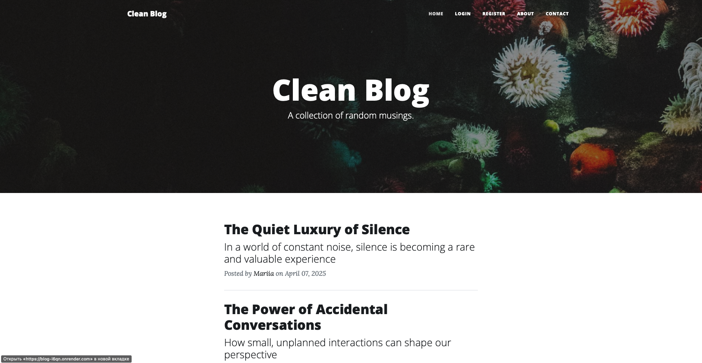
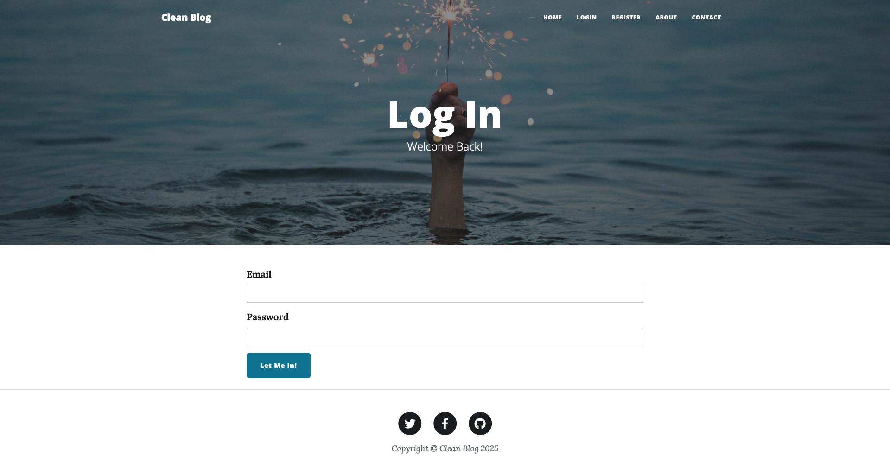
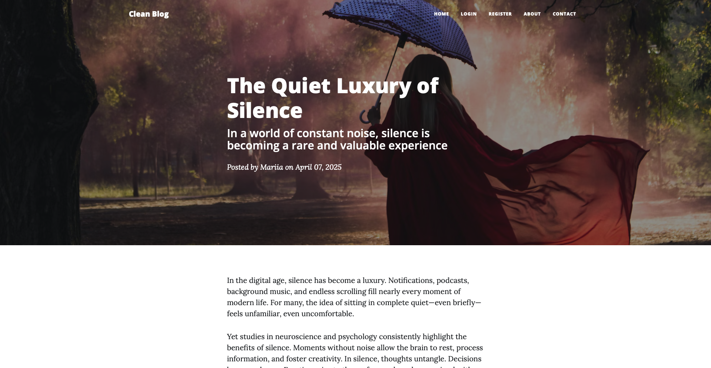
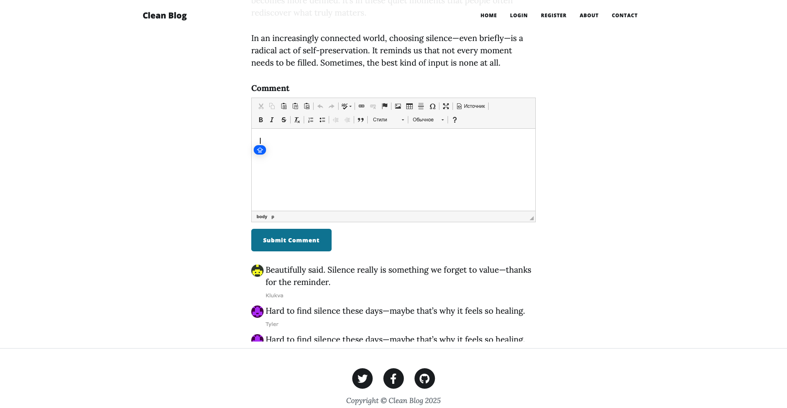

# 📝 Flask Blog with Authentication

A full-featured blogging platform built with Flask.  
This project includes user registration and login, blog post creation, editing, deletion, and commenting — all styled with a clean, responsive interface.

🌐 **Live demo:** [https://blog-i6qn.onrender.com](https://blog-i6qn.onrender.com)

---

## 🚀 Features

✅ User authentication (Register, Login, Logout)  
✅ Admin-only post management (Create, Edit, Delete)  
✅ Rich-text editor (CKEditor) for posts and comments  
✅ Dynamic routing with Jinja2 templates  
✅ Comment system with Gravatar support  
✅ Custom styling with Bootstrap  
✅ Environment-based access control

---

## 🛠️ Tech Stack

- **Backend:** Flask, SQLAlchemy, Flask-Login, Flask-WTF
- **Frontend:** Jinja2 templates, Bootstrap 5, CKEditor
- **Authentication:** Flask-Login
- **Database:** SQLite (can be swapped with PostgreSQL/MySQL)
- **Other:** Flask-Bootstrap, Flask-CKEditor

---

## ▶️ Installation & Usage

### 1. Clone the Repository

```bash
git clone https://github.com/klukva-codes/Blog.git
cd Blog
```

### 2. Install Dependencies

```bash
pip install -r requirements.txt
```

### 3. Set Environment Variables

Create a `.env` file and add:

```env
FLASK_APP=main.py
FLASK_ENV=development
SECRET_KEY=your-secret-key
```

### 4. Run the App

```bash
# Option 1: if using Flask CLI
flask run

# Option 2: universal way
python main.py
```

Then open `http://127.0.0.1:5000` in your browser.

---

## 📸 Screenshots

### 🏠 Homepage  


### 🔐 Login Page  


### ✍️ Post View  


### 💬 Comment Section  


---

## 📂 Folder Structure

```
Blog/
├── main.py
├── forms.py
├── requirements.txt
├── templates/
│   ├── header.html / footer.html / index.html ...
├── static/
│   ├── assets/img/
│   │   ├── home-preview.png
│   │   ├── login-preview.png
│   │   ├── post-preview.png
│   │   └── comment-preview.png
│   └── css/styles.css
└── README.md
```

---

## 👤 Admin Access

The first registered user becomes the admin.  
Admin users see extra options: create new post, edit, delete

---

## 🙌 Author

Made with ❤️ by [klukva-codes](https://github.com/klukva-codes)  
Deployed on [Render](https://render.com)
